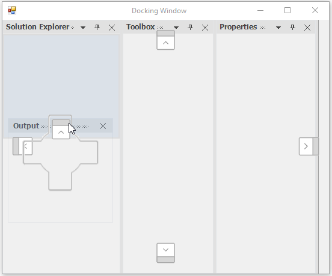

# Restrict-window-docking-side-using-DockingPreviewHint-event-in-Winforms
End users can restrict windows to dock on specific sides of the target dock windows or the edges of a form. Customize the dock hint visibility to show dock hints only on a specific side.

## Inner Dock Ability
The SetDockAbility function helps to get or set the DockAbility of docked control using another child window that can be docked inside the docked control. The GetDockAbility provides the dock ability information of the docked panel.

# C#

    //Getting the Dock Ability

    this.dockingManager1.GetDockAbility(this.panel1);

    //Setting the Dock Ability

    this.dockingManager1.SetDockAbility(this.panel1, "Top");

### Outer dock ability
 
The SetOuterDockAbility function helps to restrict the DockAbility of child window to any particular side when it is moved to the client area. In the following code snippet, the right, left, tabbed, and fill dock abilities have been restricted.

# C#

    this.dockingManager1.SetOuterDockAbility(child, Syncfusion.Windows.Forms.Tools.DockAbility.Top | Syncfusion.Windows.Forms.Tools.DockAbility.Bottom);

